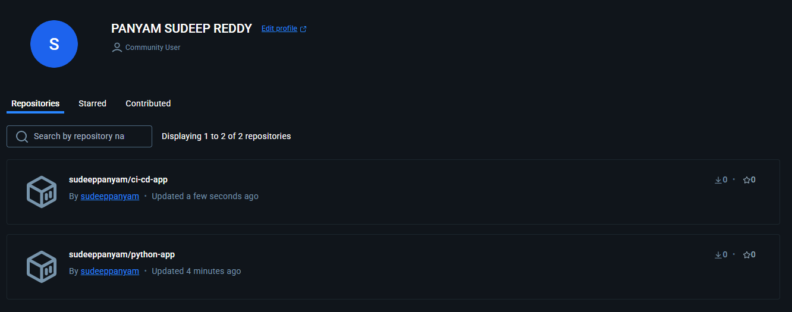

# Automated Docker Builds with GitHub Actions

This repository demonstrates how to set up a CI/CD workflow using GitHub Actions to automatically test, build, and push a Docker image to DockerHub.

## Project Structure

```
project/
├── app/
│   ├── __init__.py
│   └── main.py
├── tests/
│   ├── __init__.py
│   └── test_main.py
├── Dockerfile
├── requirements.txt
├── .github/
│   └── workflows/
│       └── docker-build.yml
└── README.md
```

## CI/CD Pipeline

The configured GitHub Actions workflow will:

1. Automatically run tests when code is pushed to the main branch or when a pull request is created
2. If tests pass and the event is a push to main (not a pull request), it will:
   - Build the Docker image
   - Push the image to DockerHub

## Setting Up the Repository

1. Create a new GitHub repository
2. Add the files from this project to your repository
3. Set up the following secrets in your GitHub repository settings:
   - `DOCKERHUB_USERNAME`: Your DockerHub username
   - `DOCKERHUB_TOKEN`: A DockerHub access token (create one in DockerHub account settings)

## Screenshot

### DockerHub Repository

1.The screenshot image being psuhed to dockerhub
